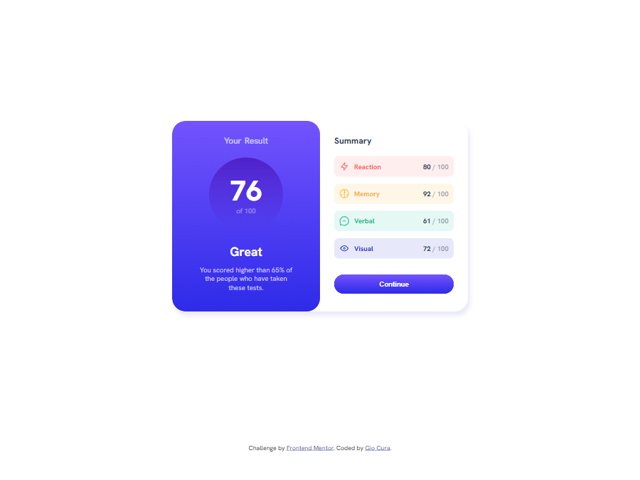

# Frontend Mentor - Results summary component solution

This is a solution to the [Results summary component challenge on Frontend Mentor](https://www.frontendmentor.io/challenges/results-summary-component-CE_K6s0maV).

## Table of contents

- [Overview](#overview)
  - [The challenge](#the-challenge)
  - [Screenshot](#screenshot)
  - [Links](#links)
- [My process](#my-process)
  - [Built with](#built-with)
  - [What I learned](#what-i-learned)
  - [Continued development](#continued-development)
- [Author](#author)
- [Acknowledgments](#acknowledgments)

## Overview

### The challenge

Users should be able to:

- View the optimal layout for the interface depending on their device's screen size
- See hover and focus states for all interactive elements on the page

### Screenshot

### Links

- Live Site URL: [Live Site](https://gc9-resultssummary.netlify.app)

## My process

### Built with

- Semantic HTML5 markup
- CSS custom properties
- Flexbox
- Mobile-first workflow
- BEM

### What I learned

- This is the first time I used CSS custom properties. I thought using it for this project would be good, since it has a lot of color variations.

- I learned to just set my Chrome Developer tools to the exact dimensions of the design mockups. This makes it easier to copy them.

- I also learned that transitions are not directly available for linear-gradients on hover. Here's what I did:

- First, set the button element as relative.
  .div {
  position: relative;
  }

- Then, add a before pseudoclass.
  .div::before {
  position: absolute;

  content: "";
  background: linear-gradient

  top: 0;
  right: 0;
  width: 100%;
  height: 100%;

  opacity: 0;
  transition: all 0.3s;
  }

- The pseudoclass will just go opaque on hover.
  .div:hover::before {
  opacity: 1;
  }

- But with only that, the text will not show. You need to set all children as position: relative.
  .div > \* {
  position: relative;
  }

- Also, I learned that the reason why my footer was overlapping in the mobile versions of my projects was because I set my <main>'s height to 100%. However, my <footer>'s not inside <main>. If the content's of the <main> are too large for the viewport, it would overflow the height.

### Continued development

- I need more practice on the different pseudoclasses.

## Author

- Frontend Mentor - [@GioCura](https://www.frontendmentor.io/profile/GioCura)

**Note: Delete this note and add/remove/edit lines above based on what links you'd like to share.**

## Acknowledgments

- Thanks to [Max K Coding](https://www.youtube.com/@maxkcoding3887) on YouTube for his [video tutorial](https://www.youtube.com/watch?v=p6aa6M8mbsY) on adding transition animatoins to elements with linear gradients!
